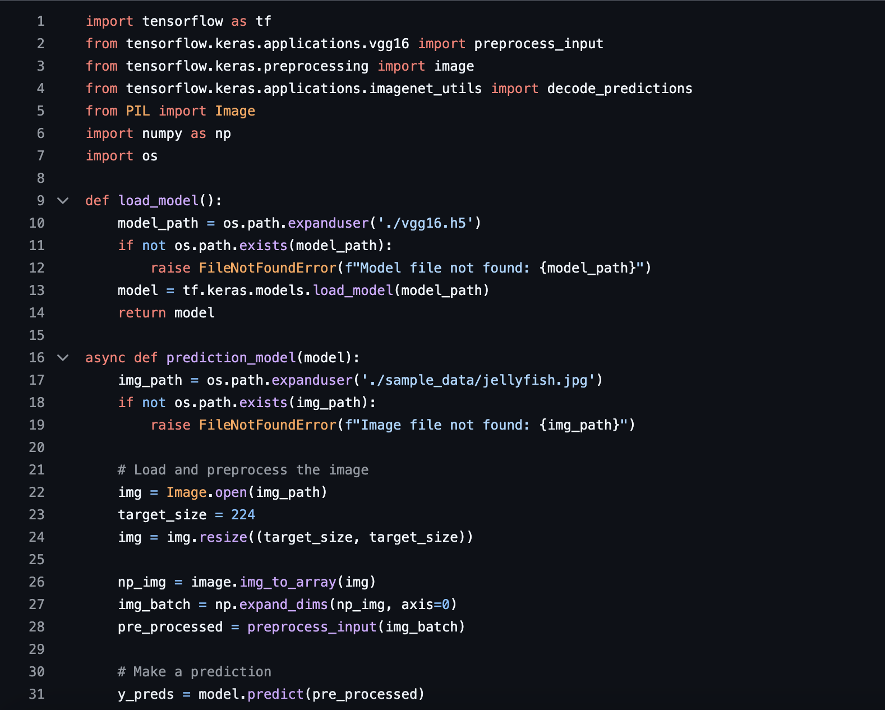
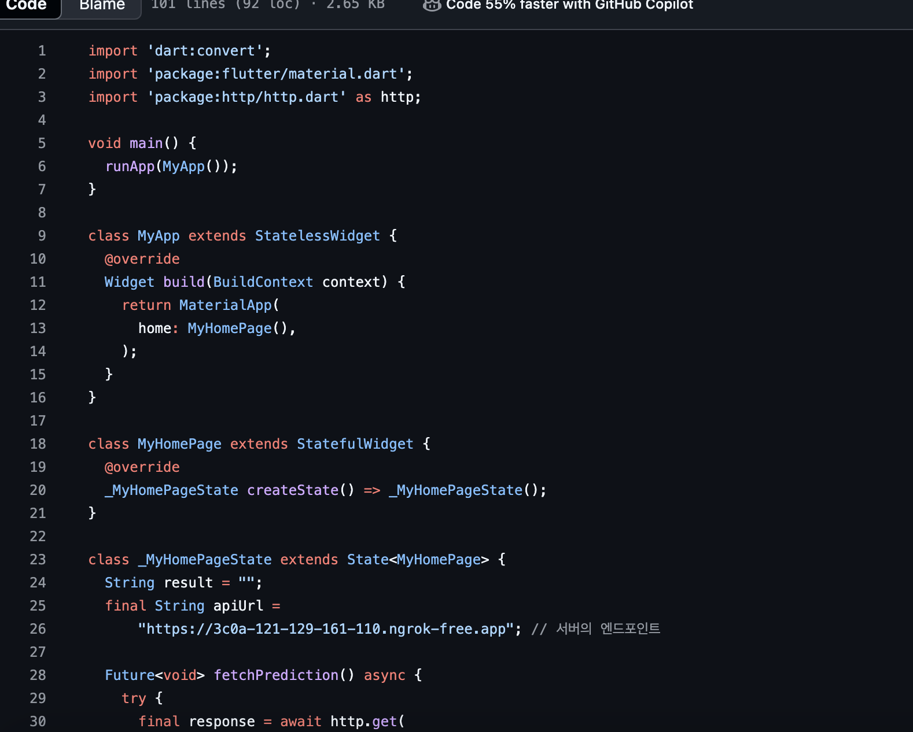
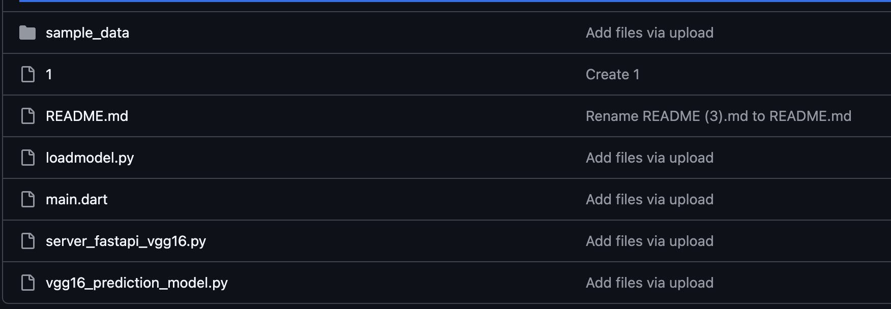

# AIFFEL Campus Online Code Peer Review Templete
- 코더 : 조계현
- 리뷰어 : 김우찬


# PRT(Peer Review Template)
- [x]  **1. 주어진 문제를 해결하는 완성된 코드가 제출되었나요?**
    - 코드 제출은 잘 되었습니다.
    - 서버문제로 해결이 안된 부분이 있었지만 리뷰어로서 코드에 특별한 이상은 찾지 못했습니다.
      -   


    
- [x]  **2. 전체 코드에서 가장 핵심적이거나 가장 복잡하고 이해하기 어려운 부분에 작성된 
주석 또는 doc string을 보고 해당 코드가 잘 이해되었나요?**
    - 상태를 나타내는 변수 작성
        - 

        
- [x]  **3. 에러가 난 부분을 디버깅하여 문제를 해결한 기록을 남겼거나
새로운 시도 또는 추가 실험을 수행해봤나요?**
  - pubspec.yaml에서 이미지 등록 후 앱에서 업로드하는 과정에서 생겼던 오류를 공유하였고, PRT 시간에 해결하였습니다.
        
- [x]  **4. 회고를 잘 작성했나요?**
    - 회고를 기록하지는 않았지만, 코드리뷰시간에 충분히 많은 애로사항에 대해 공유하여 인정합니다.
    - 해당 퀘스트에 시간이 매우 부족하였습니다.

        
- [x]  **5. 코드가 간결하고 효율적인가요?**
    - 효과적으로 코드가 작성되었다


# 회고(참고 링크 및 코드 개선)
```
# 고생 많으셨습니다. 서버문제에 대해 조금 더 같이 고민해보고 해결해나가면 좋을 것 같다는 생각이 듭니다.
```
