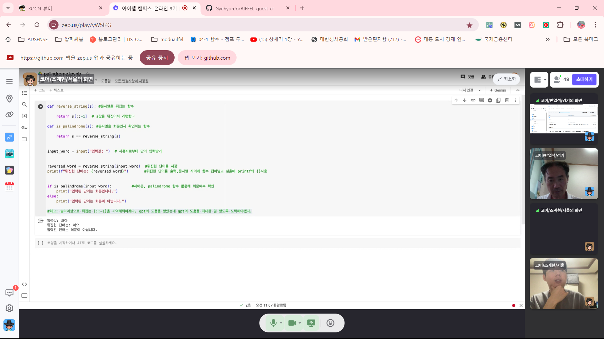

# AIFFEL Campus Online Code Peer Review Templete
- 코더 : 조계현, 방미선
- 리뷰어 : 반업석


# PRT(Peer Review Template)
- [X]  **1. 주어진 문제를 해결하는 완성된 코드가 제출되었나요?**
    - 주석 처리와 깔끔하고 간결한 코딩문장이 합쳐진 정결한 이미지의 코팅의 완성이 느껴짐
      
- [X]  **2. 전체 코드에서 가장 핵심적이거나 가장 복잡하고 이해하기 어려운 부분에 작성된 
주석 또는 doc string을 보고 해당 코드가 잘 이해되었나요?**
    - 다른 개발자들이 보기 알기 쉽게 해설해 놓았다는게 인상적...
        
- [X]  **3. 에러가 난 부분을 디버깅하여 문제를 해결한 기록을 남겼거나
새로운 시도 또는 추가 실험을 수행해봤나요?**
    - 팀별 과정으로 개관적으로 평가되는 이상, 코더들의 협업과정의 이미지가 그려졌음..
    - 자체 기록에 의거 꼼꼼한 검수과정이 돋보임.
        
- [X]  **4. 회고를 잘 작성했나요?**
    - 자기 본연의 주관적인 과정의 과오와 앞으로의 모티베이션을 이끌만한 현 과정을 넘어설 이미션을 잘 묘사함
        
- [X]  **5. 코드가 간결하고 효율적인가요?**
    - 코드 중복은 거의 없고, 함수를 적재적소로 잘 배치해 코딩을 함.
       

# 회고(참고 링크 및 코드 개선)
```오늘 처음 코딩에, 시스템 프로세스에 적응하는데 있어,어려움이 많았던 하루였고, 앞으로 배워야 할 스킬도 먼치 앞에 있지만,
좋은 배움으로의 한 발로 느껴지는 하루 였음.

# 리뷰어의 회고를 작성합니다.
# 코드 리뷰 시 참고한 링크가 있다면 링크와 간략한 설명을 첨부합니다.
# 코드 리뷰를 통해 개선한 코드가 있다면 코드와 간략한 설명을 첨부합니다.
```
