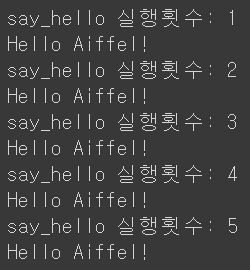

# AIFFEL Campus Online Code Peer Review Templete
- 코더 : 조계현
- 리뷰어 : 최성호


# PRT(Peer Review Template)
- [X]  **1. 주어진 문제를 해결하는 완성된 코드가 제출되었나요?**
    - 두 문제 다 원하는 결과가 정상적으로 출력되는 코드를 작성하셨습니다!
    - 
    - 
    
- [X]  **2. 전체 코드에서 가장 핵심적이거나 가장 복잡하고 이해하기 어려운 부분에 작성된 
주석 또는 doc string을 보고 해당 코드가 잘 이해되었나요?**
    - 첫번째 문제에서 제일 중요한 최댓값 및 최솟값을 구하는 과정이라서, 제일 핵심적인 부분이라고 판단했습니다.
    - 두번째 문제에서 제일 중요한 함수 호출 횟수를 구하는 과정이라서, 제일 핵심적인 부분이라고 판단했습니다.
    - 첫번째 문제의 사진에는 주석이 잘 작성되어 있습니다.
    - 두번째 문제의 사진에는 전체 코드가 한 번 지워지고 다시 작성하셔서 시간이 부족하셔서 주석을 작성하지 못했다고 전달받았습니다.
    - 첫번째 문제와 두번째 문제 모두 해당 사진을 보고 이해가 잘 되었습니다.
    - 
    - 
        
- [X]  **3. 에러가 난 부분을 디버깅하여 문제를 해결한 기록을 남겼거나
새로운 시도 또는 추가 실험을 수행해봤나요?**
    - 첫번째 문제에서 클로저 함수가 값을 잘 저장해 누적하는지를 확인하기 위해, count 변수를 만들어 # 문자를 누적하는 코드를 작성하였습니다.
    - 두번째 문제에서 같은 원리를 이용해서, 반복문을 사용하지 않은 구구단을 작성하였는데 매우 인상적이었습니다.
    - 
    - 
        
- [X]  **4. 회고를 잘 작성했나요?**
    - 두 분 다 회고를 잘 작성해주셨습니다!
    - 
        
- [X]  **5. 코드가 간결하고 효율적인가요?**
    - 코드 자체가 많이 간결하고, 읽기도 쉬운 효율적인 코드였습니다.
    - 중복되는 코드 없이 매우 효율적이었습니다.
    - 


# 회고(참고 링크 및 코드 개선)
```
수준 높은 코드를 봤었고, 효율적이고 간결하면서도 제대로 된 기능을 작성하는 코드가 무엇인지 알게 되었습니다!
```
